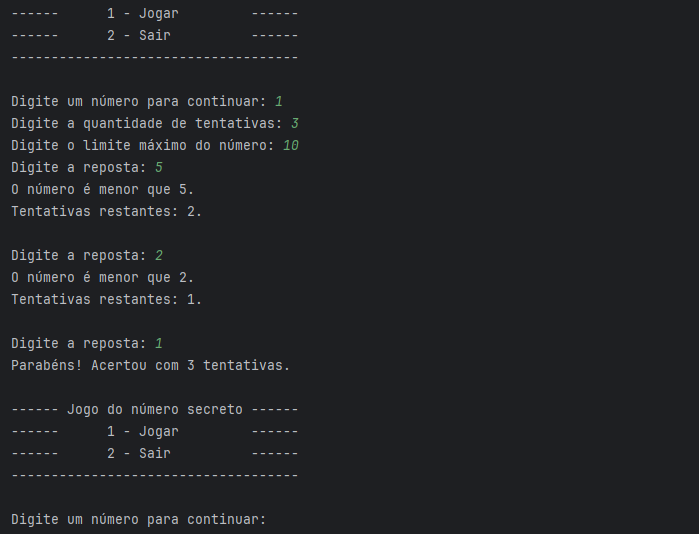
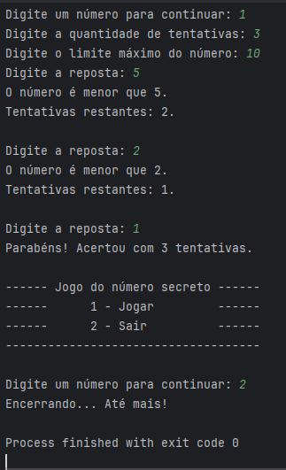

# Jogo do número aleatório Java

Olá, seja bem vindo ao meu projeto Jogo do número aleatório.
Trata-se de um exercício para prática de Java, para por em prática e compartilhar meus aprendizados.

## Explicando o código e funcionalidades

Este projeto implementa um jogo simples de adivinhação de números em Java, o sistema gera um número aleatório e o usuário precisa descobrir qual é dentro de um número limitado de tentativas.

A maior parte da lógica do programa é centrada na classe NumeroAleatorio.
No início da classe são declaradas as principais variáveis utilizadas durante a execução do jogo:
limite: define o valor máximo que pode ser gerado pelo número aleatório
numero: armazena o número sorteado
tentativas: quantidade de tentativas disponíveis para o jogador
contador: registra quantas tentativas já foram realizadas

Também é utilizada a classe Random para gerar o número aleatório.
O método setLimite, define o valor máximo para geração do número aleatório. Caso o usuário informe um valor inválido (por exemplo, um número negativo), o limite padrão será definido como 100. Esse método também reinicia o contador quando um novo jogo começa.
O método setTentativas, permite definir quantas tentativas o usuário terá para acertar o número. Se for informado um valor inválido, o sistema define automaticamente 1 tentativa.
O método getTentativas, apenas retorna a quantidade de tentativas restantes.
Já o método validarResposta, verifica se o número digitado pelo usuário está correto. A cada tentativa o contador é incrementado. Se o usuário acertar, o sistema retorna uma mensagem informando que o número foi descoberto e encerra o jogo. Caso o valor esteja errado, o número de tentativas é reduzido e o sistema informa se o número correto é maior ou menor que o valor informado. Se todas as tentativas acabarem, o jogo revela qual era o número sorteado.

E a classe Main é responsável por iniciar o programa e controlar a interação com o usuário pelo terminal. Nela é criado um objeto Scanner para leitura dos dados e uma instância da classe NumeroAleatorio, que contém a lógica do jogo.
O programa exibe um menu que permite iniciar uma nova partida ou encerrar a aplicação. Ao escolher jogar, o usuário define o número de tentativas e o limite máximo do número aleatório. Em seguida, o sistema recebe as tentativas do usuário e envia cada resposta para o método validarResposta, responsável por verificar se o número secreto foi acertado. O programa continua executando até que o usuário escolha sair.

## Screenshots

